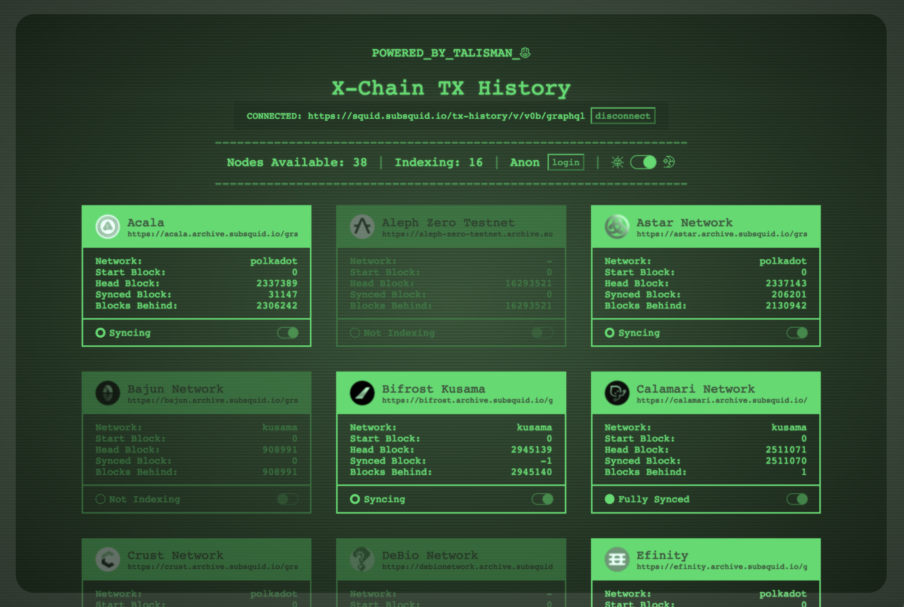

# Talisman TX History UI Control Panel

## ℹ️ What is this?

**This is an indexer status & control panel for [Talismans' multichain TX history firesquid](https://github.com/TalismanSociety/txhistory-squid).** 

This web-app connects to an instance of a **TX history squid** and provides the user with a UI to view the indexed status of chains. 

**Admin** can login to the UI and manage which chains are actively being indexed.

The pool of available nodes is **automatically fetched** from public archive nodes on subsquid and provided to the user to manage.

*Note: an admin password is required to be configured on your TX history firesquid instance in order to use admin functionality*

---
## 🖥️ Usage
Run this applicaiton locally or host it on a server.

### `Locally`
1. Clone the repo `git clone git@github.com:TalismanSociety/txhistory-admin-ui.git`
2. In the project directory run `yarn start` (this should automatically open [http://localhost:3000](http://localhost:3000) to view the UI)

### `Hosted`
Dependent on your hosting provider; configure as a standard react application.

### `Configuration`
Create a `.env.local` file (clone `.env.example`) and provide a `REACT_APP_ENDPOINT_URL` value to automatically connect the appliaction to a hosted multichain tx history squid.

*Note: If no value is provided, the app will prompt the user to enter a URL.*

---
## 👨‍💻 Development
1. Set up codebase locally as above
2. Use `yarn test` to launch the test runner in the interactive watch mode.
3. Use `yarn build` to build the app for production

---
## 💳 License

txhistory-admin-ui is [GPL 3.0 licensed](LICENSE).